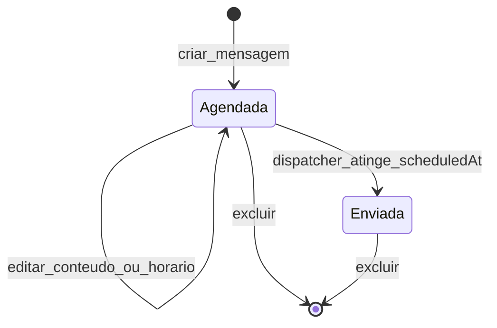

# [SendFlow](https://lp.sendflow.com.br/) Challenge

<a href="https://sendflow-broadcast-challenge.web.app" target="_blank">
	
</a>

## Visão Geral

<p align="center">
	<b>Para testar a aplicação, basta acessar o frontend publicado em:<br/>
	<a href="https://sendflow-broadcast-challenge.web.app" target="_blank">https://sendflow-broadcast-challenge.web.app</a></b>
</p>

Este repositório contém o [desafio técnico Full Stack da SendFlow](https://voceligado.notion.site/Desenvolvedor-Full-Stack-30b1b3f4dcd3803fa0d2f179c6a3d793), focado em um SaaS multi-tenant para envio de mensagens em broadcast: cada cliente gerencia suas próprias conexões, base de contatos e disparos com agendamento — e o estado de cada mensagem evolui automaticamente até o envio.

<p align="center">
	<b>Stack principal do projeto</b><br/>
	
	
	
	
	
	
	
	
</p>

## Objetivo

Este repositório foi construído como desafio técnico, com foco em:

- isolamento multi-tenant por `clientId` em todas as camadas (cliente, regras e funções);
- modelagem de fluxo de negócio orientado a estados (ciclo de vida da mensagem);
- testabilidade e confiabilidade dos fluxos principais (autenticação, CRUD e dispatcher);
- legibilidade e evolução contínua do código (paradigma funcional, tipagem estrita, erros tipados).

## Modelo UML do Problema: Ciclo de Vida da Mensagem

Este diagrama UML (state machine) representa o problema central que o projeto buscou resolver: a evolução controlada do status da mensagem desde a criação até o envio, executada de forma assíncrona pelo dispatcher agendado.



A transição `Agendada → Enviada` é determinada exclusivamente pela Cloud Function `dispatchScheduledMessages`, que roda a cada 1 minuto (`onSchedule`) na região `southamerica-east1`, busca documentos com `status == "scheduled"` e `scheduledAt <= now`, e os atualiza em batch para `status: "sent"` com `sentAt: now`.

## Decisões Técnicas

Esta seção resume, em ordem cronológica, o que foi construído, por que cada escolha foi feita e como foi implementada tecnicamente.

### 1) Fundação da aplicação

Primeiro, montei uma base técnica estável para reduzir retrabalho nas etapas seguintes. O frontend foi estruturado com Vite + React 19 + TypeScript, separado em `web/` enquanto as funções ficam em `functions/`. O design system inicial combina Material UI (componentes, tema customizado violeta) e Tailwind CSS v4 (apenas a camada utilitária para não conflitar com o `CssBaseline` do MUI). O Firebase foi inicializado uma única vez em `firebaseConfig.ts`, com validação de variáveis de ambiente e suporte ao emulador de Auth em desenvolvimento. O objetivo técnico aqui foi garantir consistência de tooling, contrato de tipos e theming antes de escalar funcionalidades.

### 2) Autenticação e isolamento multi-tenant

Com a base pronta, implementei login/cadastro com Firebase Auth, expondo o `userId` (igual ao `clientId` do tenant) globalmente via Context API (`AuthProvider`). Componentes `PrivateRoute` e `PublicRoute` protegem rotas autenticadas e públicas, respectivamente, e `react-router-dom@7` com `createBrowserRouter` define a hierarquia. O `userId` propaga-se para todos os hooks de dados, que aplicam `where("clientId", "==", userId)` em toda query do Firestore. Em paralelo, as regras de segurança foram reescritas para garantir o mesmo isolamento no lado servidor (`request.auth.uid == resource.data.clientId`), porque confiar apenas no filtro do cliente seria insuficiente.

### 3) CRUD em tempo real e separação de responsabilidades

Na sequência, criei os hooks `useConnections`, `useContacts` e `useMessages` seguindo o mesmo padrão: assinatura via `onSnapshot` para escuta em tempo real, ações funcionais (`create`/`update`/`delete`) com `addDoc`/`updateDoc`/`deleteDoc`, e retorno de `{ data, loading, error, ...actions }` para consumo limpo nas páginas. Cada página de CRUD (`ConnectionsPage`, `ContactsPage`, `MessagesHistoryPage`) usa esse contrato para listar, criar via modal, editar inline e excluir com diálogo de confirmação. A separação entre apresentação e dados foi feita propositalmente para que páginas permaneçam reativas a mudanças sem polling, e para que a lógica de persistência seja testável de forma isolada.

### 4) Sistema de mensagens e dispatcher assíncrono

A Fase 5 do desafio exigia que mensagens agendadas mudassem de status no horário do disparo "via funções". Implementei isso com `firebase-functions/v2/scheduler` (`onSchedule("every 1 minutes")`), Firestore Admin SDK e um índice composto `(status, scheduledAt)` para que a query do dispatcher seja performática. O `BroadcastsPage` permite selecionar múltiplos contatos, escrever a mensagem e, opcionalmente, agendar via `DatePicker` + `TimeField` do MUI X (locale `pt-BR`, formato `DD/MM/YYYY HH:mm`) — o `scheduledAt` final é composto a partir desses dois campos via `useMemo`. Quando preenchido, o botão "Agendar" é habilitado; caso contrário, "Enviar Agora" persiste a mensagem com `scheduledAt: now`, que o dispatcher trata no próximo tick. Mensagens enviadas e agendadas são listadas em `MessagesHistoryPage` com filtro por status, e mensagens agendadas podem ser editadas ou excluídas.

### 5) Endurecimento, observabilidade de erros e polimento de UX

Na fase final, padronizei tratamento de erros com uma camada tipada (`AppError`, `ErrorCode`, `translateError`) compartilhada conceitualmente entre `web/src/lib/errors` e `functions/src/errors`, com mensagens i18n e um `ErrorSnackbarProvider` para feedback global. Adicionei testes com Vitest + Testing Library cobrindo a camada de erros e o provider de snackbar, em ambos os pacotes. Refinei a UX com: campos de senha com botão de mostrar/ocultar, navegação rápida no `BroadcastsPage` que rola e foca o campo correto a partir do header, máscara de telefone brasileira e formatação de datas em pt-BR. As últimas decisões técnicas priorizaram fluidez operacional sem expor identificadores internos (document IDs, UID) ao usuário final.

## Arquitetura

```
sendflow-broadcast/
├── functions/                       # Cloud Functions (Node 24)
│   └── src/
│       ├── errors/                  # AppError + códigos + i18n
│       └── index.ts                 # dispatchScheduledMessages (onSchedule 1m)
├── web/                             # SPA Vite + React 19
│   └── src/
│       ├── components/              # PrivateRoute, PasswordField, forms
│       ├── contexts/                # AuthProvider
│       ├── hooks/                   # useAuth, useConnections, useContacts, useMessages...
│       ├── layouts/                 # MainLayout (sidebar + AppBar)
│       ├── lib/errors/              # AppError, translate, ErrorSnackbarProvider
│       ├── pages/                   # Dashboard, Broadcasts, Connections, Contacts...
│       └── theme.ts                 # tema MUI customizado
├── firestore.rules                  # multi-tenancy: clientId == auth.uid
├── firestore.indexes.json           # composite (status, scheduledAt)
└── firebase.json
```

## Instalação e Execução

### 1. Pré-requisitos

- Node.js 24+;
- npm 10+;
- Firebase CLI (apenas para deploy): `npm i -g firebase-tools`.

### 2. Configurar variáveis de ambiente

Crie `web/.env.local` com a configuração do Firebase Web SDK:

```env
VITE_FIREBASE_API_KEY=...
VITE_FIREBASE_AUTH_DOMAIN=...
VITE_FIREBASE_PROJECT_ID=...
VITE_FIREBASE_STORAGE_BUCKET=...
VITE_FIREBASE_MESSAGING_SENDER_ID=...
VITE_FIREBASE_APP_ID=...
```

### 3. Instalar dependências

```bash
npm --prefix web install
npm --prefix functions install
```

### 4. Rodar em desenvolvimento

```bash
npm --prefix web run dev
```

Aplicação disponível em http://localhost:5173.

### 5. Validar qualidade

Checagem de tipos + build (`tsc -b && vite build`):

```bash
npm --prefix web run build
```

Lint:

```bash
npm --prefix web run lint
npm --prefix functions run lint
```

Testes:

```bash
npm --prefix web run test:run
npm --prefix functions run test --silent
```

### 6. Deploy

Deploy completo (hosting + rules + indexes + functions) — exige projeto no plano Blaze para as funções:

```bash
firebase deploy
```

Apenas hosting (plano Spark é suficiente):

```bash
npm --prefix web run build
firebase deploy --only hosting
```

## O que faria com mais tempo

- **Integração real de provedor de mensageria** — plugar Twilio ou WhatsApp Cloud API no dispatcher, com chave gerenciada via `firebase functions:secrets:set` e fallback de canais por cliente.
- **Rastreabilidade de entrega por destinatário** — registrar, em coleção top-level com `messageId` + `contactId`, o status individual (`pending`/`sent`/`failed`/`opt_out`), permitindo dashboard de entrega por contato e retry granular sem precisar reagendar a mensagem inteira.
- **Quotas e rate limiting por tenant** — proteger custo e evitar abuso via janelas deslizantes por `clientId`, com limites configuráveis e degradação previsível quando atingidos.
- **Trilha de auditoria** — registrar quem editou ou cancelou cada agendamento, com data e diff, para suportar contestação interna e investigação de incidentes.
- **Templates com variáveis e segmentação** — permitir reuso de mensagens com placeholders (`{{nome}}`) resolvidos no momento do envio, mais segmentação de contatos por tags para campanhas direcionadas.

## Escopo

Projeto com finalidade avaliativa. Não representa integralmente requisitos de produção como integração real com provedor de mensageria, observabilidade detalhada (logs estruturados, traces, alertas), operação em escala (rate limiting, quotas, retry policies) ou conformidade regulatória (LGPD, opt-out, retenção).
